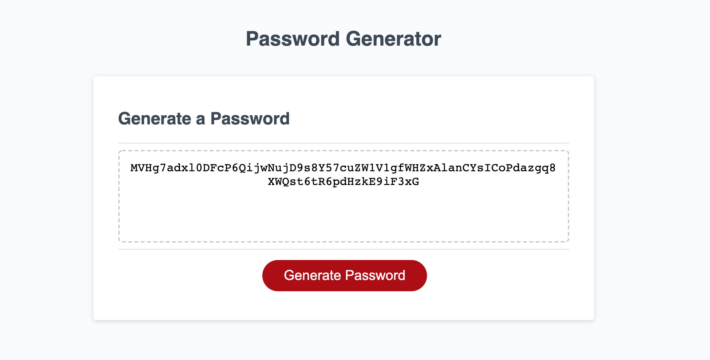

# 03 JavaScript: ShanPassword Gen

## Project Description

To create an application that an employee can use to generate a random password. This app is designed to run in the browser, and features dynamically updated HTML and CSS powered by JavaScript. This application includes a simplistic, clean, and polished user interface that is responsive, thus ensuring that it adapts to multiple screen sizes.

## Project Purpose 

The purpose of this application is to create a password generator that can allow employees to protect/restrict access to sensitive information. With a random password generator, users will be able to include certain character formats that will be chosen to produce stronger passwords that allow for greater security.

* This project applies HTMl, CSS, and Javascript. With the use of Javascript, we are able to dynamically assess user input criteria to randomly generate stronger passwords.

# Demo Features:
* The following image and gif shows the web application's appearance and functionality:

# Live URL:
<a href="https://sjohn214.github.io/ShanPasswordGen/">ShanPassword Gen URL Live</a>

<a href="https://github.com/sjohn214/ShanPasswordGen.git">ShanPassword Gen GitHub Repo</a>

# Summary
* In this project a password generator was created utilizing HTML, CSS, and Javascript. Javascript is used heavily to create the responsive outputs based of user input responses for password strength needs.

# Special Features:
* HTML page
  * Index.html
    * Landing with card text box.
* CSS elements 
  * Develop folder including style.css to be displayed on Index.html.
* Javascript page
  * Develop folder including javascript script.js file
    * Set Variables
    * Page loads with prompt questions
    * Prompts for dynamic password length (within 8-128 characters) and format criteria
    * Click button to generate password
    * Generated password is display in field on page matching selected criteria

# Authors
* Shannondale Page (student) <a href="https://github.com/sjohn214">Git Hub Profile</a>
* Austin Bruch (Bootcamp Instructor)
* Jon Jackson (Bootcamp TA Instructor)
* Daniel Sires (Bootcamp Tutor)