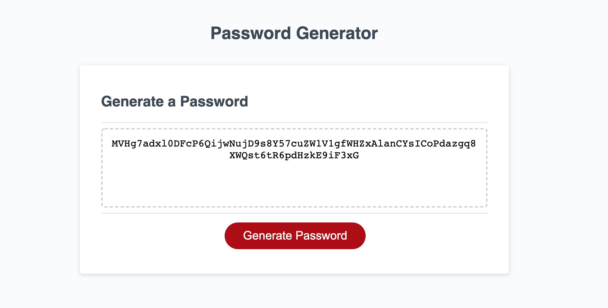

# Shan's Password Generator

# Project Description:

* This project was designed as a homework assignment for UNCC's coding bootcamp.

* This application emphasizes the use of Javascript to generate a random, secure password for the user.

* This project has been deployed to GitHub Pages. To get this project up and running, you can follow the deployment link.

# Demo Features

* The following image and gif shows the web application's appearance and functionality:

# Live URL:
  https://sjohn214.github.io/ShanPasswordGen/

# Summary

* HTML and CSS and Javascript documents create a random password generator

* This project emphasizes the use of using Javascript to make dynamic changes to an HMTL document.

# This project has the following features:

* A generate button
This will send the user a series of prompts and confirms

* After user data is collected, a random password will be generated using Javascript.
* A Text-area will display the users password once it is generated.

# Features:
One HTML Pages
* Index.html
* Contains basic user input items and buttons with divs and ids

One CSS Page
* Styles.css
* Contains centering and styling for   html user input features
* Contains media queries

One Javascript Page 
  * Contains: 
  * Variables 
  * Arrays
  * Value placeholders 
  * Minimum of two event listeners 
  * Minimum of two if/else if statements 
  * One function outside of first event listener

# Authors
Shannondale Page (student) <a href="https://github.com/sjohn214">Git Hub Profile</a>
Austin Bruch (Bootcamp Instructor)
Jon Jackson (Bootcamp TA Instructor)
Daniel Sires (Bootcamp Tutor)